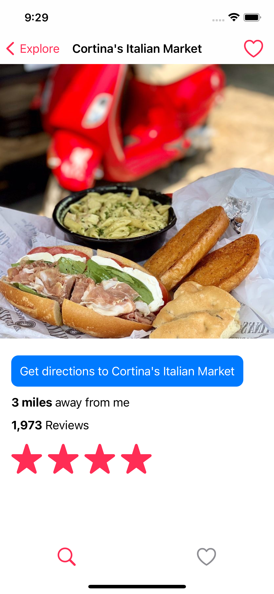

# Yelper


-   Yelp clone, a simplified version of Yelp.
-   Helps you find any restaurants nearby your locations.

## Technologies:

-   Swift
-   SwiftUI
-   Core Location
-   Core Data

## How to run project:

```bash
git clone https://github.com/quangnguyen17/yelper.git
cd yelper
xed .
```

## Demo Screenshots:

<div class="d-flex">
    
    
    
    
</div>
<div class="d-flex">
    
    
    
    
</div>
